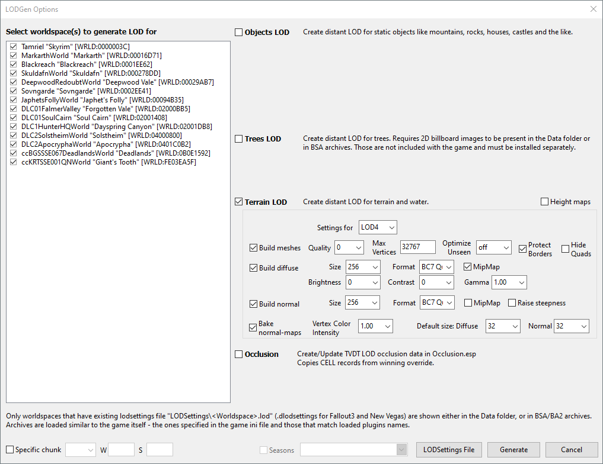
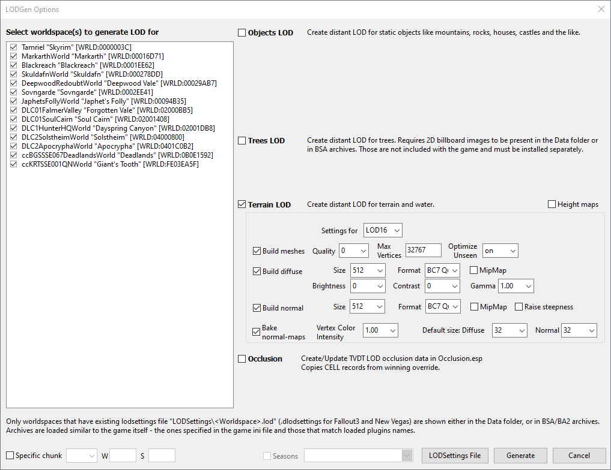

# SSELODGen

## Settings

> **Note**
>
> Enable the `xLODGen Resource - SSE Terrain Tamriel` mod before generating terrain LOD.
> Disable it once terrain LOD generation is finished.

<details><summary>Show LOD4 options</summary>



</details>

<details><summary>Show LOD8 options</summary>


</details>

<details><summary>Show LOD16 options</summary>



</details>

<details><summary>Show LOD32 options</summary>


</details>

LOD generation time: ~30 minutes.

### Reset settings

If Skyrim was installed to `C:\GOG Games\Skyrim Special Edition`, delete the following file:

```plaintext
C:\Users\<USERNAME>\AppData\Local\Skyrim Special Edition GOG\plugins.sseviewsettings
```

If Skyrim was installed to `C:\GOG Games\Skyrim Anniversary Edition`, delete the following file:

```plaintext
C:\Users\<USERNAME>\AppData\Local\Skyrim Anniversary Edition GOG\plugins.sseviewsettings
```

## References

- [Official documentation](https://dyndolod.info/Help/xLODGen)
