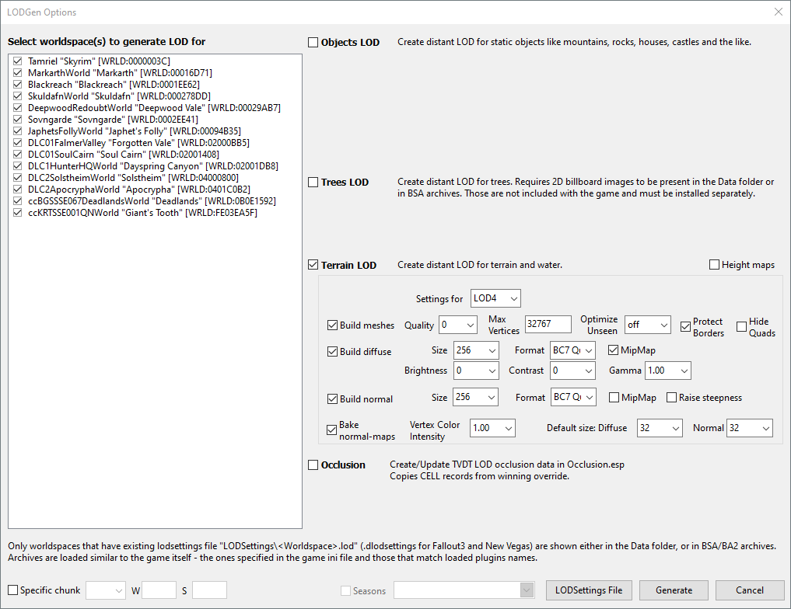
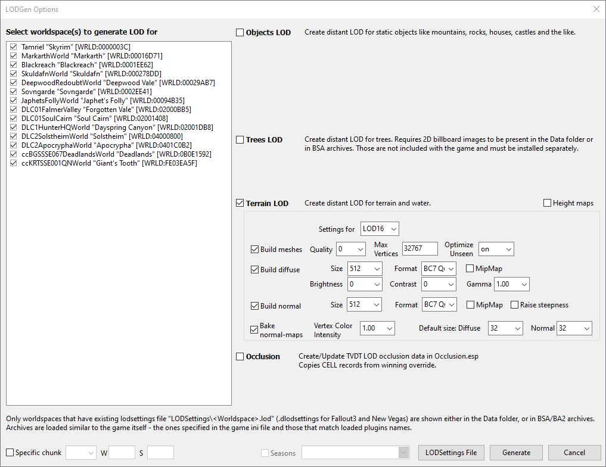

# Run SSELODGen

## Generate terrain LOD

1. Enable the `xLODGen Resource - SSE Terrain Tamriel` mod.

1. Run the `SSELODGen` executable.

1. Select all worldspaces.

1. Select `Terrain LOD`.

1. Set LOD4 options:

    

1. Set LOD8 options:

    

1. Set LOD16 options:

    

1. Set LOD32 options:

    

1. Click `Generate`.

    LOD generation time: ~30 minutes.

1. Once LOD generation is complete, close SSELODGen.

1. Disable the `xLODGen Resource - SSE Terrain Tamriel` mod.

## Reset settings

If Skyrim was installed to `C:\GOG Games\Skyrim Special Edition`, delete the following file:

```plaintext
C:\Users\<USERNAME>\AppData\Local\Skyrim Special Edition GOG\plugins.sseviewsettings
```

If Skyrim was installed to `C:\GOG Games\Skyrim Anniversary Edition`, delete the following file:

```plaintext
C:\Users\<USERNAME>\AppData\Local\Skyrim Anniversary Edition GOG\plugins.sseviewsettings
```

## References

- [Official documentation](https://dyndolod.info/Help/xLODGen)
